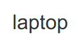

# ccf-code

some studying codes to solve ccf problems using CC

first and a test for git version control

version 2



## Test code

        #include <iostream>
        using namespace std;
        int main()
        {
            cout<<"hello world"<<endl;
            return 0;
        }

- test
  - test1
  - test2


```flow
st=>start: 开始
op=>operation: My operation
cond=>condition: Yes or No?
e=>end: 结束
st->op->cond
cond(yes)->e
cond(no)->op
```
